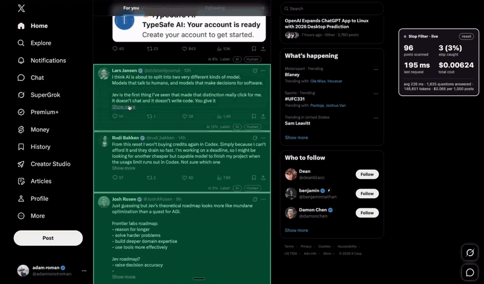

<h1>slop-filter </h1>

The goal of this project is to collectively pursue an internet without having to sift through slop. It doesn't end at posts on X or comments on Reddit. It also means blocking bot accounts, YouTube and TikTok videos with AI-generated scripts, and whatever comes next.

Today it is a Chrome and Firefox extension that hides AI-generated posts and comments on X, LinkedIn, and Reddit, and comments and videos on YouTube. A video is judged by its script, never by its title or thumbnail.



## What it does

- Scores every post in your feed for how likely it is to be AI-written.
- Collapses the ones over your threshold. One click shows a post again.
- Animated mode lets you watch it work: a scan line runs over each post, then the post turns green and stays, or turns red and folds away.
- Can be tuned to your own judgment. Mark posts as `AI` or `Human`, then fit the weights from your labels.

## How it does it

1. It reads the text of each post as it nears your screen.
2. It asks [TypeSafe Jev](https://docs.typesafe.ai) 30 narrow questions about how the text is written, not what it says. Human tells come first: an invented word, a joke, a stretched or repeated word, a typo. A confident one settles it as human. Then the AI tells. A person can be generic or repeat the post they answer, and that is not AI. The tells are in the cadence: the "it's not X, it's Y" pivot, three matching beats in a row, a tidy bow on the end, words that add importance and no information, and sentence rhythm so even it reads rehearsed. Plain code counts the rest: em dashes, the colons and semicolons models switch to when told to avoid them, and stock vocabulary.
3. Jev answers each question with a probability. It writes no text and gives no opinions.
4. The extension combines the answers into one score with weights. A small script fits those weights from the posts you labeled.
5. Posts under 5 words are left alone. There is too little to judge.

You bring your own TypeSafe API key. It stays in your browser. Post text is sent to TypeSafe for scoring and nowhere else. See the [privacy policy](PRIVACY.md). 1,000 posts cost about 4 cents.

## Install

Paste this into Claude Code, Codex, or any coding agent:

```text
Read https://raw.githubusercontent.com/adamnroman/slop-filter/main/SKILL.md and follow it to install Slop Filter in Chrome or Firefox.
```

Your agent clones the repo and walks you through the few clicks Chrome requires. Your API key goes into the extension's options page, never into the chat.

Or do it by hand: clone this repo. For Chrome, open `chrome://extensions`, turn on Developer mode, and click Load unpacked. For Firefox, run `node scripts/zip.mjs firefox`, extract the resulting archive, open `about:debugging#/runtime/this-firefox`, click Load Temporary Add-on, and select the extracted root `manifest.json`. Then open the extension's options and paste your [TypeSafe API key](https://console.typesafe.ai/keys).

## Tune it and contribute

[SKILL.md](SKILL.md) teaches your coding agent how to update it, add a tell you noticed, fit the weights from your labels, and add a site. [docs/development.md](docs/development.md) has the full detail. To send a change back, see [CONTRIBUTING.md](CONTRIBUTING.md).

## Releases

See [CHANGELOG.md](CHANGELOG.md) and the [releases page](https://github.com/adamnroman/slop-filter/releases). Each release has the extension as a zip you can unpack and load.

## Credits

The detection rules, their examples, and the word lists are adapted from the [unpolish-ai-writing](https://github.com/wilu222/unpolish-ai-writing) skill by wilu222 (MIT), which removes these tells from text. Slop Filter uses the same tells to spot them.

<a href="https://www.flaticon.com/free-icons/poop" title="poop icons">Poop icons created by HideMaru - Flaticon</a>

## License

[MIT](LICENSE) for the code. The bundled Fredoka font is under the SIL Open Font License. The icon is under the Flaticon license with the credit above, not MIT. See `assets/icons/ATTRIBUTION.txt`.
